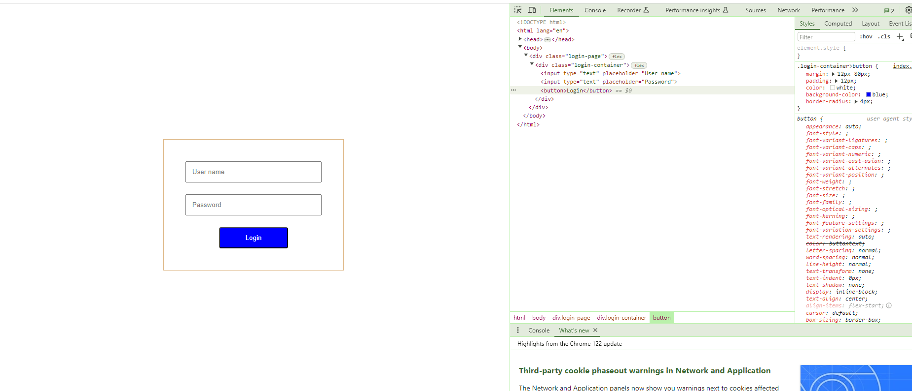

# code-campus-level1 Day 10

## Learn
- Head on to the tutorial: [CSS Tutorials](https://www.w3schools.com/css/)
- Learn concepts like - Margins, Padding, Box Model, Flexbox, background color, border, display, max-width, overflow, specificity, !important.

## Task1
- Create your index.html document. Check how to write CSS and apply on html elements. Note: In index.html, you can make use of style tag and write css in it.
- Try to create a login page like below:

- You can explore the entire page and try things in this link: [CSS tutorial](https://www.w3schools.com/css/)
- Make the login box in the center of the page.
- Make sure you have given some margin and padding.
- You may also beautify based on your wish.

## Task2
- Open the developer tools in your browser (check in the internet about how you can do this)
 
- Check how responsive it is when you resize.
- Try to choose different mobile device options in your developer tool of the browser. (Research on this)

### Note:
Explore as much as possible. Post all your outputs.    
Post your outputs.    

If you are facing any issues, 
- Make use of [discussions](https://github.com/kfuture2024/code-campus-level1/discussions/11) 
- Ask in the Wildr CodeCampus community. 
[Click here on your phone](https://wildr.com/invite/ioaN)