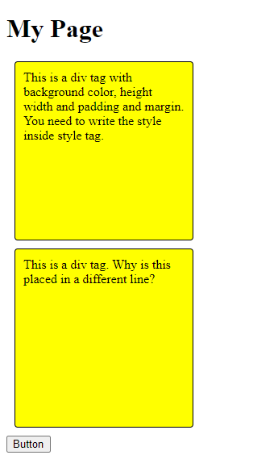
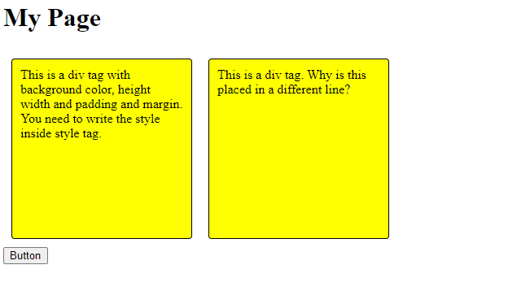

# code-campus-level1 Day 5

## Learn
- [CSS Selectors](https://www.w3schools.com/css/css_selectors.asp)
- [CSS Colors](https://www.w3schools.com/css/css_colors.asp)
- [CSS Borders](https://www.w3schools.com/css/css_border.asp)
- [CSS Margins](https://www.w3schools.com/css/css_border.asp)
- [CSS Padding](https://www.w3schools.com/css/css_padding.asp)

## Task1
- Create your first index.html document. Check how to write CSS and apply on html elements. Note: In index.html, you can make use of style tag and write css in it.
- Try to create blocks like below

- You can explore the entire page and try things in this link: [CSS tutorial](https://www.w3schools.com/css/)
- (Not required to place in the center, you can try that too.)

# Task 2
- Increase the border radious, thickness, change background color, font, etc. Explore the CSS positioning on the block you created. Post your tries- and results.
- Change the button color. Try to make it slightly bigger.

# Task 3
- This is a try for you: Try to bring the boxes one by the side of other.

- Check flex box. [CSS Flex box](https://www.w3schools.com/css/css3_flexbox.asp)
- You can use any html tags and you can nest as you wish

# Task 4
- You may try to place the boxes on top-left, top-right, center, bottom etc.
- You may also try to make the boxes transparent, blurr etc.

### Note:
Explore as much as possible. Post all your outputs.    
Post your outputs.    

If you are facing any issues, 
- Make use of [discussions](https://github.com/kfuture2024/code-campus-level1/discussions/6) 
- Ask in the Wildr CodeCampus community. 
[Click here on your phone](https://wildr.com/invite/ioaN)
