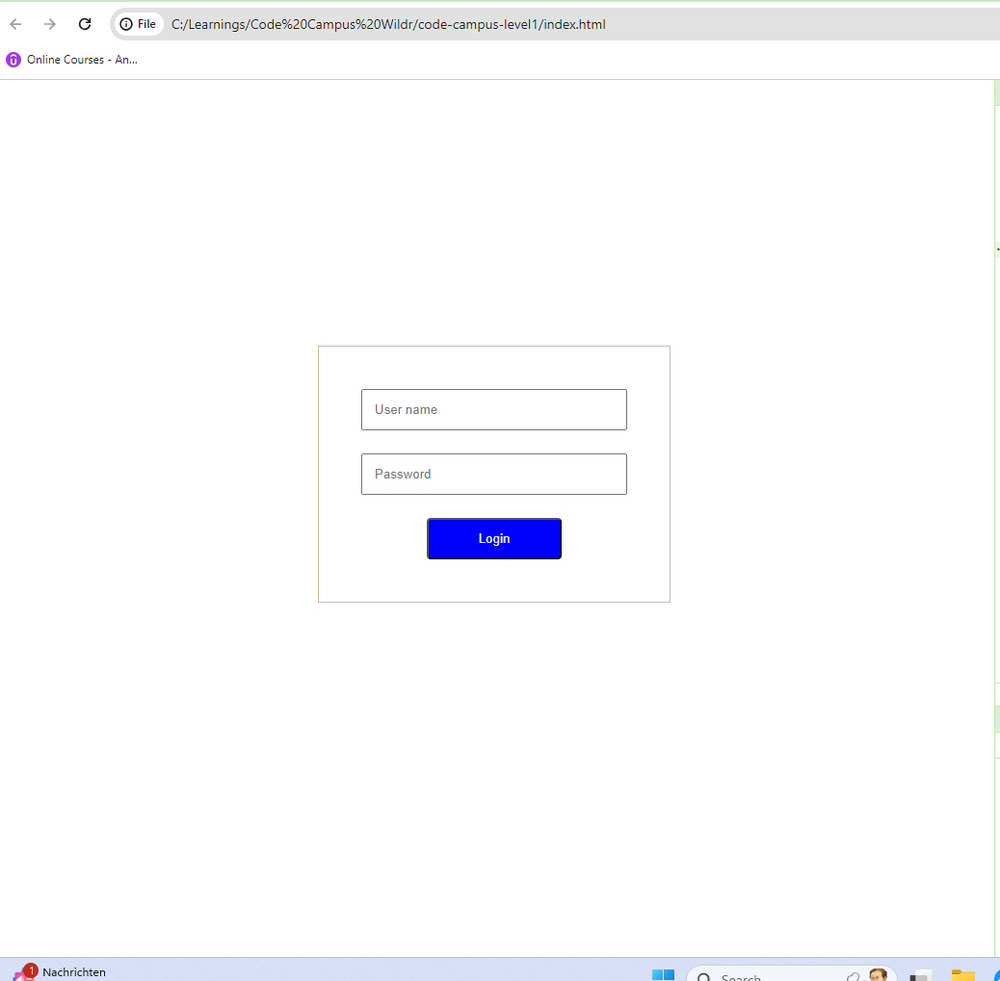

# code-campus-level1 Day 12

## Learn
- Head on to the tutorial: [CSS Tutorials](https://www.w3schools.com/css/)
- Learn concepts like - Margins, Padding, Box Model, Flexbox, background color, border, display, max-width, overflow, specificity, !important.
- Learn how to embed javascript code in html page

## Task1
- You have created a login page in day 11 challenge.

- Add a validation in your login page.
- If the user name or password are empty - show the error to the user. Either an alert or an error message on the UI.
- (You may try creating a function inside script tag and call on click of login button or use a form)

## Task2
- Try to make the page more meaningful.
- Try to add format validation like user name cannot contain symbols spaces etc..
- Define your validation rules for the form.
- Extra: (Try to Show the error message below the user name and password.)
- Extra: You may also try to show a message below the login button.

### Note:
Explore as much as possible. Post all your outputs.    
Post your outputs.    

If you are facing any issues, 
- Make use of [discussions](https://github.com/kfuture2024/code-campus-level1/discussions/13) 
- Ask in the Wildr CodeCampus community. 
[Click here on your phone](https://wildr.com/invite/ioaN)
